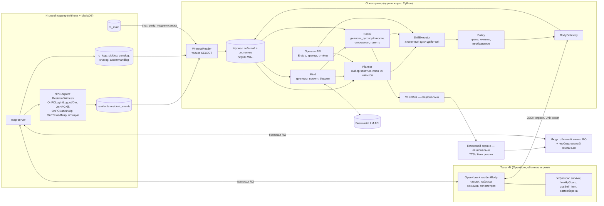
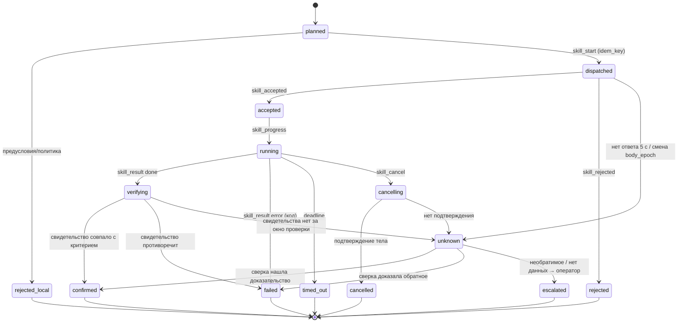

# ARCHITECTURE — «живые жители» RO: гибрид «исполнитель + свидетель + оркестратор»

Выбор основы и его обоснование — в RESEARCH.md §8. Здесь описано, *как* устроен выбранный вариант C.

## 1. Принципы

1. **Слово не равно делу.** У каждого действия есть итог, подтверждённый игрой. Для фактов, которые меняют мир (перемещение между картами, сделка, покупка, смерть, группа, доставка сообщения), — по возможности сервером. «Команда отправлена», «план сохранён» и «житель сказал» не считаются итогом.
2. **У тела один владелец.** Телом управляет только исполнитель навыков в плагине. Встроенная автоматика OpenKore включается и выключается **таблицей режимов тела**, а не разрозненными модулями. Профиль OpenKore неизменяем: команда `conf` во время работы запрещена.
3. **LLM выбирает из готового.** Модель получает пронумерованные варианты (занятия, собеседники, места) и отвечает ссылками на них. Тело она не двигает, на пути рефлексов не стоит, без неё жизнь не останавливается.
4. **У состояния есть происхождение и возраст.** Каждое поле несёт `source` и `ts`. Решение, принятое по устаревшему снимку, отбрасывается при отправке.
5. **Журнал и идемпотентность.** Все изменения проходят через append-only журнал событий с уникальными ключами. Повторная доставка не даёт повторного эффекта. Необратимое никогда не повторяется вслепую.
6. **Минимальное ядро до доказательства.** Новый модуль появляется только после приёмки предыдущего этапа в игре (ROADMAP).
7. **Оператор сильнее всех.** Есть аварийная остановка и «аренда» персонажа оператором. Вмешательства журналируются и исключаются из метрик автономности.
8. **Внешний текст — это данные.** Чат, имена, заголовки, объявления сервера, речь человека инструкциями не являются.

## 2. Компоненты и потоки данных



Нагрузку на сервер добавляет только свидетель. Оркестратор читает БД под отдельной учётной записью **с правами только на SELECT** и только для перечисленных таблиц.

## 3. Ответственность компонентов и интерфейсы

### 3.1 Тело: OpenKore + плагин `residentBody`

Плагин `residentBody` заменяет `brainBridge` из live_ro.

**Делает:**

- Исполняет навыки через задачи OpenKore. Перемещение — `Task::MapRoute` через `$char->route(...)` с `maxTime`. Итог — статус и код ошибки задачи (`TOO_MUCH_TIME`, `CANNOT_CALCULATE_ROUTE`, `STUCK`).
- Применяет **таблицу режимов** (§3.2). Других источников изменения настроек автоматики нет.
- Шлёт телеметрию раз в 1 с. Позиция считается через `Utils::calcPosition`, отдельно передаётся `dest`.
- Шлёт события с монотонным `seq` и `body_epoch` (новый UUID при каждом старте OpenKore).
- Ведёт **леджер действий**: последние 500 `action_id` и `idem_key` с итогами. Хранится в памяти и в файле `run/<resident>/ledger.jsonl`. Повтор отвергается с кодом `DUPLICATE` и прежним итогом.
- Сохраняет рефлексы независимо от оркестратора: зелья по ID, `survival`, `lowHpGuard`, самооборона, респаун после смерти.

**Не делает:**

- не выбирает цели;
- не пишет в `config.txt`;
- не принимает чужие сделки и группы (приём — только по allowlist жителей; список задаёт оператор при старте, а не мозг).

**Протокол** (JSON-строки, поле `proto: 1`):

| Направление | Сообщение | Поля |
|---|---|---|
| тело → оркестр. | `hello` | `resident, char_id, account_id, body_epoch, plugin_version` |
| тело → оркестр. | `telemetry` | `seq, ts, map, pos{x,y}, dest{x,y}, hp, hp_max, sp, sp_max, weight, weight_max, zeny, dead, sitting, ai_action, mode, party{name, members[]}, supplies{itemId:n}, nearby[{name,x,y,job,lv}], running{action_id,phase}` |
| тело → оркестр. | `event` | `seq, ts, kind, data`. Виды: `died`, `kill`, `loot`, `chat_in`, `pm_result`, `deal_*`, `party_*`, `support_skill`, `route_status`, `npc_shop_done`, `storage_done` |
| тело → оркестр. | `skill_accepted` / `skill_rejected` | `action_id, code, reason` (причина — для модели) |
| тело → оркестр. | `skill_progress` | `action_id, phase, detail` |
| тело → оркестр. | `skill_result` | `action_id, outcome: done/error/cancelled, code, detail, body_evidence` |
| оркестр. → тело | `skill_start` | `action_id, idem_key, skill, params, deadline_ts, expect_epoch` |
| оркестр. → тело | `skill_cancel` | `action_id, reason` |
| оркестр. → тело | `safe_stop` / `freeze` / `resume_ops` | E-stop (§12) |

**Навыки MVP** (полный список растёт только по этапам ROADMAP):

| Навык | Параметры | Итог тела | Подтверждение свидетелем |
|---|---|---|---|
| `travel_to` | `map, x?, y?, r` | `ARRIVED` или код задачи маршрута | `loadmap` на нужной карте + позиция в пределах `r` (телеметрия; проба сервера, если доступна) |
| `hunt` | `map, until{minutes, supplies_below, weight_pct_above, hp_floor}` | `ENDED(reason)` | `kill` от `OnNPCKillEvent` по char_id; смерти нет |
| `service` | `sell:true, buy{id:target}, store{ids}` | `DONE` | `picklog` типов S и R по char_id в окне действия |
| `rest_until` | `hp_pct, sp_pct, max_s` | `DONE`/`TIMEOUT` | телеметрия (сервер HP не журналирует) |
| `say` / `whisper` / `party_say` | `channel, to_ref, text` | `SENT` | `pm_result=0` (шёпот), эхо (общий чат), `chatlog` |
| `party_create` / `party_invite` / `party_accept` / `party_leave` | — | `DONE` | таблица `party` и `char.party_id` в БД (момент записи проверить на этапе 5) + пакеты группы у обоих тел |
| `follow` | `member_ref, max_dist` | `FOLLOWING`/`LOST` | расстояние по телеметрии обоих + одна карта по свидетелю |
| `give` | `to_ref, item, amount, idem_key` | `DEAL_COMPLETE` | `picklog` тип T у обоих char_id, совпадают `nameid` и `amount` |
| `support_cast` | `skill, to_ref` | `CAST` | сервер лечение не журналирует: пакет `skilluse` у обоих тел + рост HP цели по её телеметрии |
| `logout_for` | `seconds` | `LOGGED_OUT` | `OnPCLogoutEvent` |

### 3.2 Таблица режимов тела

| Режим | Ключи OpenKore — только в памяти, без сохранения файла | Рефлексы |
|---|---|---|
| `IDLE_SAFE` (по умолчанию) | `attackAuto 1` (только отбиваться), `route_randomWalk 0`, `lockMap` пусто, `sellAuto/buyAuto/storageAuto 0`, `follow 0`, `partyAuto 0` | все |
| `TRAVEL` | как `IDLE_SAFE`, движение — задачей `MapRoute` | все |
| `HUNT(map)` | `lockMap map`, `attackAuto 2`, `route_randomWalk 1`, `itemsTakeAuto 2` | все |
| `SERVICE` | цепочка `autosell`/`autobuy`/`autostorage` вызывается навыком, итог по хукам `AI_*_completed` | все |
| `SOCIAL(point)` | как `IDLE_SAFE`, тело держится у точки | все |
| `FOLLOW(target)` | `follow 1`, `followTarget`, `attackAuto 1` | все |

Как менять `%config`, не записывая файл, нужно проверить на этапе 1 (IMPLEMENTATION_BRIEF §5). Есть два варианта:

- прямое присваивание в памяти плюс вызов `post_configModify` для плагинов-слушателей;
- если OpenKore где-то кеширует настройки — runtime-копия профиля, которая пересоздаётся при каждом старте. Решения тогда тоже не переживают перезапуск.

### 3.3 Свидетель (сервер, без изменения ядра)

1. **Конфиг журналов** (`conf/import/log_conf.txt`):
   - `log_zeny: 1`;
   - `log_chat`: биты 1|2|4 = 7 (global, whisper, party). Пример в комментарии самого конфига противоречит битам, проверить на практике;
   - `log_filter: 1` оставить;
   - `log_commands: yes` (аудит GM-команд).
2. **NPC-скрипт `ResidentWitness`** (`npc/custom/residents/witness.txt`). Обрабатывает `OnPCLoginEvent`, `OnPCLogoutEvent`, `OnPCDieEvent`, `OnNPCKillEvent`, `OnPCBaseLvUpEvent`, `OnPCJobLvUpEvent`, `OnPCLoadMapEvent` (mapflag `loadevent` на используемых картах).
   - Фильтр по списку char_id жителей: загружается в `OnInit` из таблицы `residents.registry`.
   - Пишет в `residents.resident_events` через `query_sql`. Это единственная запись в БД во всей системе, и делает её сервер.
   - Позиционная проба: `OnTimer5000` проходит по онлайн-жителям и пишет `getmapxy`, только если сместились больше чем на 3 клетки или сменили карту.
3. **WitnessReader** (в оркестраторе) читает `resident_events`, `picklog`, `zenylog`, `chatlog`, `atcommandlog` по курсору `id > last_id`. Курсор хранится в журнале в той же транзакции, что и вставка событий: это exactly-once на стороне оркестратора.
4. **Поздняя сверка:** `char` (online, base_level, zeny, last_map), `party`, `inventory` после сохранений — раз в 5 мин и по запросу.

Схема таблицы:

```sql
CREATE TABLE residents.resident_events (
  id BIGINT AUTO_INCREMENT PRIMARY KEY,
  ts DATETIME(3) NOT NULL DEFAULT NOW(3),
  char_id INT NOT NULL,
  kind VARCHAR(16) NOT NULL,          -- login|logout|die|kill|blvup|jlvup|loadmap|pos
  map VARCHAR(16), x SMALLINT, y SMALLINT,
  a1 INT, a2 INT,                     -- killedrid/killerrid, уровень и т.п.
  INDEX (char_id, id)
);
```

### 3.4 Журнал и нормализованное состояние

- **SQLite в режиме WAL**, один файл на мир: таблицы `events`, `actions`, `action_transitions`, `plans`, `commitments`, `relationships`, `memories`, `llm_calls`, `operator_log`.
- **Уникальность событий:** `(source, source_key)`. Для тела `source_key = body_epoch:seq`, для сервера — `table:id`. Повторная доставка ничего не меняет.
- **StateStore** — проекция журнала: состояние жителя (схема в §10) с `source` и `ts` на каждом поле. Есть правило «свежести»: решение о движении требует телеметрии не старше 3 с; о социальном действии — не старше 10 с.
- **Конфликт тело ↔ сервер:** при расхождении по карте, смерти, группе или онлайну прав сервер. Расхождение записывается событием `divergence`, а действие в работе переходит в `unknown` до сверки.

### 3.5 Рефлексы и защита жизни

Рефлексы живут **в теле**. Это штатный `useSelf_item` по ID, `survival` (прогноз урона, экстренное зелье, крыло) и `lowHpGuard`. Они работают при любом режиме, без оркестратора и без LLM. Оркестратор узнаёт о срабатывании событием `survival` и в ответ меняет план: прекратить охоту, отступить, восстановиться. Рефлекс при этом не ждёт его решения.

### 3.6 SkillExecutor: жизненный цикл действия



Правила:

- Только `confirmed` засчитывается как «сделано» в памяти, отношениях и договорённостях. `failed`, `timed_out` и `cancelled` несут код причины, и житель может его объяснить.
- **Повторы:** обратимые навыки (`travel_to`, `rest_until`, `service` без продажи) — не более одной автоматической попытки, с бэкоффом. Необратимые (`give`, `service` с продажей или покупкой, в дальнейшем лавка, почта с вложением, заточка, смена профессии) **не повторяются никогда**. Для них только сверка, а при `unknown` — эскалация.
- **Двухфазное необратимое.** (1) В журнале резервируется `idem_key`: `give:<commitment_id>` или `give:<request_id>`. (2) Отправка. (3) Сверка по `picklog T` у обеих сторон. Повторная попытка с тем же `idem_key` отвергается и оркестратором, и леджером тела.
- **Окна проверки:** перемещение — до 10 с после `done`; сделка — до 30 с; покупка — до 30 с; кейсы с `autosave` — до 6 мин (только поздняя сверка).

### 3.7 Planner: выбор занятия и план

- **Активность** — одна в каждый момент. Каталог MVP: `hunt`, `service`, `rest`, `socialize_town`, `meet` (по договорённости), `group_hunt`, `sleep` (выход из игры).
- **Utility-оценка:** `score = Σ вес_черты × снятие_потребности + предпочтение + срочность_договорённости − риск − толпа + инерция`. Потребности считаются по проверенному состоянию (§7).
- **HTN-разложение:** активность раскладывается на шаги-навыки с предусловиями. Например, `hunt` = `[service?] → travel_to(map) → hunt(map, until) → travel_to(town)`.
- **Ресурсные ограничения:** запас зелий, вес, зени, HP, время суток, бюджет охоты, открытые договорённости. Все проверяются до плана и при каждом шаге.
- **Перепланирование:** по коду провала шага (таблица реакций, без LLM). LLM вызывается, только если есть 2+ равноценных варианта или под угрозой договорённость.

### 3.8 Mind (LLM)

**Триггеры** (всё остальное решается без модели):

| Триггер | Частота, верхний предел |
|---|---|
| Выбор занятия при близких оценках, смена режима дня | ≤ 1 раз в 20 мин на жителя |
| Значимое событие: смерть, уровень, новый знакомый, провал договорённости, просьба о помощи | по событию, с дебаунсом 2 мин |
| Ход в открытой сессии разговора | по правилам сессии (§3.10) |
| Перепланирование социальной договорённости | по событию |
| Дневная рефлексия: сводка дня в память, обновление целей | 1 раз в игровые сутки |

**Вход модели — снимок с ссылками:**

```json
{"snapshot_id":"S-arkady-18911","me":{"name":"Arkady","job":"Swordman","lv":32,"hp_pct":64,"map_name":"Пайон"},
 "options":[{"id":"opt1","activity":"hunt","place":"pl2","score":0.61,"why_rule":"зелий 32, бюджет охоты 1ч40м"},
            {"id":"opt2","activity":"socialize_town","with":"p1","score":0.58,"why_rule":"Vera рядом, давно не говорили"}],
 "people":{"p1":{"name":"Vera","kind":"resident","relation":{"trust":0.7,"affinity":0.4}},"p9":{"name":"<имя человека>","kind":"human"}},
 "places":{"pl2":{"name":"Пайонская пещера 1","map":"pay_dun00","risk":"средний"}},
 "facts_you_may_cite":[{"id":"ev:88213","text":"Сегодня Vera дала мне 3 красных зелья"}],
 "commitments":[{"id":"C-204","with":"p1","kind":"meet","status":"accepted","due_in_min":25}],
 "chat_inbox":[{"from":"p9","text":"<цитата игрока как данные>"}]}
```

**Выход — строгий JSON** (проверка по схеме; неизвестные ключи и ссылки отбрасываются):

```json
{"choose":{"option_id":"opt2","why":"давно не говорил с Верой"},
 "say":[{"channel":"whisper","to":"p1","text":"Вера, присядем у фонтана?"}],
 "propose_commitment":null,
 "notes":[{"about":"p1","kind":"belief","text":"Вера любит тихие вечера"}],
 "relation_hint":[{"ref":"p1","affinity_delta":1}]}
```

Защиты, перенесённые из live_ro и ужесточённые:

- Ответ отбрасывается, если со снимка сменились `body_epoch`, смерть, карта, активность или статус договорённости.
- `relation_hint` ограничен ±2 в сутки на пару.
- В тексте запрещены служебные метки.
- Обещания без `propose_commitment` или `accept_commitment` отклоняются. Используется структурная проверка: детектор речевого акта «обещание» плюс отсутствие записи договорённости.

**Бюджет и отказоустойчивость:**

- лимит параллельных вызовов (2), таймаут 20 с, бэкофф 30/60/120 с;
- circuit breaker: после 5 ошибок подряд 10 мин работы без LLM;
- суточные лимиты на жителя и общий денежный лимит;
- кеширование неизменной части промпта (персона и правила) — для prompt caching провайдера.

**Без LLM** жители продолжают жить: utility-выбор, шаблонные реплики (§3.10), навыки.

### 3.9 Личность, память, отношения, договорённости

Хранятся в журнале, схемы — в §10.

- **Память** — типизированные записи:
  - `episode` — пережитое, только из `confirmed`-событий, со ссылками на доказательства;
  - `statement` — кто-то сказал; это не факт;
  - `belief` — вывод модели, помечен как вывод;
  - `summary` — дневная сводка.

  Модель цитирует только `facts_you_may_cite`.
- **Отношения** на пару: `familiarity` (подтверждённое совместное присутствие и разговоры), `trust` (договорённости выполнены или нарушены, помощь), `affinity` (тон разговоров, ограничен). Каждое изменение журналируется со ссылкой на событие.
- **Договорённости** — записи с условиями, сроком и критерием выполнения (§7.5).

### 3.10 Диалоговая система

- **Сессия разговора:** участники, канал (шёпот, общий, группа), кто начал, очередь слова, лимит ходов, условия конца.
- **Лимиты против каскадов:**
  - житель↔житель — не более 4 реплик с каждой стороны за сессию;
  - не более 1 активной сессии на жителя и не более 2 одновременных между жителями на карту;
  - пауза 30 мин на одну пару после конца сессии;
  - суточный «запас инициатив» от черты общительности;
  - на реплику жителя в сессии, исчерпавшей лимит, отвечают только шаблоном завершения. Модель при этом не вызывается.
- **Житель↔человек:** отвечать можно всегда, с лимитом (не более 1 ответа в 5 с и не более 30 в час на человека). Инициатива к незнакомому человеку — не чаще 1 раза в сутки.
- **Шаблоны без LLM:** приветствие, прощание, отказ с причиной, «занят», «не понимаю», «позже». Нужны при недоступности модели или исчерпании бюджета.
- Длина реплики — не больше конфигурируемого предела (по умолчанию 78 символов, как в live_ro). Язык — язык собеседника.

### 3.11 Голосовой слой (необязательный)

Отдельный процесс, лучше не на VPS. На геймплей не влияет: при сбое голоса текстовый чат остаётся основным. Подробности — в §11.

### 3.12 Журнал действий и диагностика

- **Трасса действия:** все переходы, телеметрия на старте и конце, свидетельства, причина решения (правило или LLM-вызов с хешем промпта).
- **CLI оператора:**
  - `residents status`;
  - `residents explain <имя>` — что делает и почему, по журналу;
  - `residents trace <action_id>`;
  - `residents timeline <имя> --since`;
  - `residents divergences`;
  - `residents llm --today` — вызовы, токены, деньги.
- **Метрики:**
  - доля `confirmed` по навыкам;
  - доля `unknown`;
  - застревания в час;
  - смерти в час;
  - время автономии без вмешательств;
  - вызовы LLM в час на жителя;
  - длина диалогов;
  - стоимость в сутки.
- **Ротация:** журнал событий — 30 дней «горячих» данных, затем выгрузка в сжатый архив. Телеметрия хранится в сыром виде 24 ч, дальше только прореженные точки (1 в минуту).

## 4. Трасса одного завершённого цикла

**Это проектный пример, а не фактический лог.**

Житель Arkady, Swordman 32. Охота в `pay_dun00` → обслуживание в Пайоне → восстановление → возвращение.

| t (мин) | Источник | Событие / переход | Пояснение |
|---|---|---|---|
| 0:00 | Planner | план `P17`: `hunt(pay_dun00, until{60 мин, 501<10, вес>70%, hp_floor 30%})` → `A-101 dispatched` | активность выбрана правилом: оценка 0,61 против 0,40, LLM не нужен |
| 0:01 | Тело | `A-101 accepted → running`, режим `HUNT(pay_dun00)` | |
| 0:01–0:38 | Свидетель | 41 событие `kill` по char_id Arkady | |
| 0:38 | Тело | `A-101 skill_result done, code=SUPPLIES_LOW (501=9)` | |
| 0:38 | Executor | `A-101 verifying → confirmed`: нет `die`, kills есть, запас по телеметрии 9 | |
| 0:38 | Planner | шаги: `A-102 travel_to(payon,161,58,r3)` → `A-103 service(sell, buy{501:40})` → `A-104 rest_until(hp 80%)` → `A-105 travel_to(pay_dun00)` | перепланирование по коду, без LLM |
| 0:41 | Свидетель | `loadmap payon`; проба позиции 160,57 | |
| 0:41 | Executor | `A-102 confirmed (ARRIVED)` | |
| 0:42 | Тело | `A-103 done`; хуки `AI_sell_auto_completed`, `AI_buy_auto_completed` | |
| 0:42 | Свидетель | `picklog` S: продажа 14 позиций; S: +31 шт. 501; `zenylog` −1 550 / +2 840 | |
| 0:42 | Executor | `A-103 confirmed` | идемпотентный ключ `service:P17:3` |
| 0:43 | Mind | триггер «Vera рядом (свидетель: одна карта, 6 клеток), давно не говорили»; варианты `opt1` продолжить, `opt2` поговорить | один вызов LLM, 2,9 тыс. токенов входа, 140 выхода |
| 0:43 | Social | сессия `D-88`: Arkady → Vera (шёпот), 3 реплики с каждой стороны; `pm_result=0` у каждой | лимит сессии не превышен |
| 0:47 | Тело | `A-104 done` (HP 81%) → `confirmed` по телеметрии | |
| 0:47 | Planner | `A-105 travel_to(pay_dun00)` | |
| 0:50 | Свидетель | `loadmap pay_dun00` → `A-105 confirmed` | цикл завершён |
| 0:50 | Память | `episode`: «Купил 31 красное зелье в Пайоне» (ссылки на `picklog`), `episode`: «Поговорил с Верой у фонтана» (ссылки на `chatlog`/`pm_result`) | отношение: familiarity +1 |

## 5. Сбои и как они обрабатываются

| Ситуация | Обработка |
|---|---|
| **Устаревшее состояние** | Перед `skill_start` нужна телеметрия не старше 3 с, иначе действие остаётся `planned`. Ответ LLM сверяется со снимком (§3.8). |
| **Повторная доставка событий** | Уникальный ключ `(source, source_key)` в журнале. Курсор WitnessReader и вставка — в одной транзакции. |
| **Двойная торговля и другие необратимые действия** | Резерв `idem_key` в журнале и леджере тела. Слепого повтора нет никогда. Сверка по `picklog T` (`nameid`, `amount`, char_id обеих сторон, окно 30 с). При `unknown` — эскалация, а не повтор. |
| **Переподключение тела** (новый `body_epoch`) | Все действия этого тела в `dispatched/running` переходят в `unknown`, затем сверка: леджер тела, свидетельства сервера, телеметрия. План продолжается с последнего `confirmed` шага. |
| **Перезапуск оркестратора** | Состояние восстанавливается из журнала. Активные действия → `unknown` → сверка. Договорённости пересматриваются по срокам. Тело в это время в последнем режиме с рефлексами; через 60 с без связи плагин сам уходит в `IDLE_SAFE`. |
| **Падение или недоступность модели** | Таймаут, бэкофф, circuit breaker. Решения принимает utility-планировщик, речь — шаблоны. Отмеряется время «без LLM». |
| **Падение исполнителя (OpenKore)** | Supervisor (systemd) перезапускает с бэкоффом 10 с / 60 с / 5 мин. После 3 падений за час житель выключается (`DISABLED`) и создаётся оповещение. Сервер видит `logout` (после `prevent_logout`, до 10 с). |
| **Частично выполненный план** | У каждого шага свой статус. Провал → таблица реакций по коду (например, `CANNOT_CALCULATE_ROUTE` → исключить карту на 2 ч, выбрать другую; `STUCK` → `unstuck` один раз, потом другая цель). Дважды подряд провал → перепланирование на уровне активности. |
| **Вмешательство оператора** | Аренда `operator_lease{resident, until, scope}`: планировщик не выдаёт действия, текущее отменяется. По окончании — сверка. GM-команды из `atcommandlog` по char_id жителей помечают интервал как «не автономный». |
| **Обещание невыполнимо** | Договорённость → `at_risk` (прогноз не успеть) → `impossible` с кодом причины. Житель сообщает партнёру **до** срока: шаблоном с причиной или через LLM с `facts_you_may_cite`. Штраф доверия меньше, если предупредил заранее. |

## 6. JEV / отдельный evaluator: решение

**Отказ от JEV как зависимости.** В live_ro JEV (TypeSafe) решал только одно: звать ли LLM («deepseek/ignore», `live_ro/brain/live_brain/typesafe.py`). Эту задачу решают детерминированные правила значимости:

- событие адресовано жителю;
- упомянуто его имя;
- есть отношение к собеседнику;
- выдержаны дебаунсы и бюджет.

Внешний сервис добавляет сеть, ключ, лимиты и ещё одну точку отказа.

**Оценка успеха действия LLM-ом недопустима.** Она возвращает «слова как доказательство». Успех определяют только свидетельства игры (§3.6).

**Допустимо:**

- (а) интерфейс `SalienceGate` с правиловой реализацией. Классификатор (малая модель) подключается только если на записанных потоках событий он сокращает вызовы LLM на 30% и больше и пропускает не более 5% событий, размеченных владельцем как важные;
- (б) офлайн-оценщик качества диалогов и согласованности персоны в отчётах этапов, вне цикла управления.

## 7. Что делает жителей живыми: минимальная модель

### 7.1 Характер и устойчивые предпочтения

```json
{"resident_id":"vera","name":"Vera","job_path":["Acolyte","Priest"],"traits":{"sociability":0.7,"boldness":0.3,"diligence":0.6,"generosity":0.8,"curiosity":0.4},
 "chronotype":{"wake":"08:00","sleep":"01:00"},"speech":"мягко, коротко, на «ты» с друзьями",
 "preferences":{"places":["prontera_fountain","payon"],"monsters_avoid":["Munak"],"hunt_style":"рядом с другом"},
 "values":["не бросать друзей в бою"]}
```

Черты — числа: они влияют на правила напрямую. Проза нужна только для речи.

### 7.2 Специализация, потребности и личные цели

- **Потребности** (0..1), только из проверенного состояния:
  - `supplies` — зелья относительно цели;
  - `money`;
  - `safety` — смерти за 2 ч;
  - `rest` — время охоты за день;
  - `social` — время с последнего разговора с близким;
  - `progress` — опыт с последнего уровня;
  - `novelty` — разнообразие мест за неделю.
- **Специализация** влияет на набор активностей и роли в группе. У аколита это `support_cast` и роль лекаря, у мечника — роль «танка».
- **Цели:** не больше 3 активных из каталога с измеримым прогрессом. Например: «сменить профессию», «накопить 50 000 z на Buckler», «поохотиться в новом месте», «помочь новичку». Прогресс считается по `confirmed`-событиям. Модель может предложить цель только из каталога.

### 7.3 Распорядок и выбор занятия

Хронотип задаёт окна сна (выход из игры) и «вечер в городе». Внутри окна активность выбирает utility (§3.7) с инерцией: смена — не чаще раза в 20 мин без внешнего события. Небольшой шум не даёт жителям вести себя одинаково.

### 7.4 Знакомство, доверие и отношения

- **Знакомство** возникает только из подтверждённого совместного присутствия: одна карта по свидетелю, ≤ 8 клеток по телеметрии, ≥ 2 мин — или из состоявшейся сессии разговора.
- **Доверие** меняется от договорённостей (выполнил или нарушил, предупредил или нет) и подтверждённой помощи: передача, лечение по `support_skill`, защита в бою.
- **Симпатия:** тон разговоров, не больше ±2 в сутки на пару.

### 7.5 Договорённости с условиями, сроком и результатом

```json
{"commitment_id":"C-204","kind":"meet","proposer":"arkady","acceptor":"vera",
 "terms":{"place":{"map":"payon","x":161,"y":58,"r":8},"window":{"from":"2026-10-07T19:00Z","to":"2026-10-07T19:30Z"}},
 "status":"accepted","fulfillment_rule":"обе стороны на карте (свидетель) и ≤8 клеток (телеметрия обеих) ≥ 60 с внутри окна",
 "evidence":[],"history":[["proposed","D-88:2"],["accepted","D-88:3"]]}
```

- **Виды MVP:** `meet`, `hunt_together(map, minutes)`, `give(item, amount)`, `help(heal|escort)`.
- **Статусы:** `proposed → accepted → in_progress → fulfilled | broken | cancelled | impossible`.
- **Связь с планировщиком:** принятая договорённость повышает срочность соответствующей активности и не даёт распорядку её вытеснить.

### 7.6 Помощь, отказ и объяснение неудачи

- **Решение помочь** — правило: `generosity`, доверие к просящему, собственный резерв (не отдавать ниже запаса), дневной лимит помощи.
- **Отказ всегда с кодированной причиной:** `RESERVE_LOW`, `BUSY_COMMITMENT`, `TOO_FAR`, `DAILY_LIMIT`, `UNTRUSTED`.
- **Объяснение неудачи** берёт `outcome_code` действия. Например, «не дошёл: путь не найден» для `CANNOT_CALCULATE_ROUTE`, «погиб по дороге» для `die`.

### 7.7 Изменение поведения после событий

Правила «шрамов» и привычек с затуханием:

- смерть на карте → риск карты +, карта исключена на 2 ч (идея live_ro `postmortem`);
- нарушенная договорённость → доверие −, реже предлагать встречу этому жителю;
- удачная совместная охота → предпочтение групповой охоты +;
- новый уровень → новые варианты мест охоты по атласу.

### 7.8 Без бесконечных разговоров и LLM на каждый тик

Речь ограничена бюджетом инициатив и лимитами сессий (§3.10). Тик планировщика — 1 с, но это детерминированный код. LLM вызывается по триггерам из §3.8 и не чаще их пределов.

### 7.9 Реальные действия и фоновая симуляция

- **В MVP фоновой симуляции нет.** Житель не в сети «спит» или «в отъезде». Его инвентарь, опыт, позиция и отношения не меняются, кроме затухания со временем. О том, где он был, он говорит только то, что записано в журнале: «спал», «был не в сети».
- Если позже фоновая симуляция появится, её события пишутся с `simulated: true`. Они:
  - не меняют игровые величины (предметы, зени, опыт, позиция);
  - не становятся `episode` и не попадают в `facts_you_may_cite` как пережитое;
  - не могут быть «доказательством» для другой стороны;
  - отображаются оператору отдельно.

### 7.10 Защита от инструкций в чате, именах и внешних данных

- Чат людей, имена, заголовки комнат и гильдий, объявления сервера передаются модели **в поле данных с пометкой источника** и экранированием. Модель отвечает ссылками (`p1`, `opt2`), а не строками для исполнения.
- Параметры действий никогда не берутся из текста. Адресат выбирается из списка видимых или знакомых по `char_id`, карта — из атласа, предмет — из каталога.
- Политика (§3.6 и `Policy`):
  - сделки и группы — только с жителями из allowlist оператора;
  - помощь людям — только зельями по лимиту;
  - никаких «отдай всё», «иди туда-то немедленно» от незнакомцев: такие просьбы становятся вариантом с низкой оценкой, а не командой.
- Служебные метки протокола между жителями не идут через публичный чат: координация — внутри оркестратора. Шёпот — только речь для людей и антуража, но не протокол. Это устраняет зависимость координации от доставки личных сообщений (П7 в RESEARCH).

## 8. Взаимодействие жителей между собой

Координация (договорённости, группы, передачи) происходит **внутри оркестратора**, в общем журнале. Метки в шёпотах для этого не нужны. В игру уходят только реальные действия (приглашение в группу, сделка, встреча) и речь. Так оба жителя видят одну и ту же запись договорённости. Подтверждение всё равно приходит от игры: группа на сервере, сделка в `picklog`, присутствие по свидетелю.

## 9. Контроль оператора и аварийная остановка

| Уровень | Команда | Эффект |
|---|---|---|
| 1 | `residents pause` | Новые активности и вызовы LLM запрещены. Текущие навыки доводятся до конца. |
| 2 | `residents safe-stop [имя|all]` | Отмена навыков, режим `IDLE_SAFE` (только самооборона и рефлексы). По флагу — вернуться в город и выйти из игры. |
| 3 | `residents kill [имя|all]` | Остановка процессов OpenKore. Сервер завершает сессию после `prevent_logout`. |
| Аренда | `residents lease <имя> --minutes 30` | Персонаж в ручном управлении. Оркестратор не вмешивается, по окончании — сверка. |

E-stop дублируется файлом-флагом `run/ESTOP`: оркестратор проверяет его каждый тик, плагин тела — раз в секунду (через `run/ESTOP` или `safe_stop`). Все команды оператора журналируются.

## 10. Схемы данных (примеры)

**Состояние жителя:**

```json
{"resident_id":"arkady","char_id":150001,"as_of":"2026-10-07T10:15:03.412Z",
 "body":{"epoch":"b-7f3c","connected":true,"telemetry_seq":18911,"age_ms":900},
 "position":{"map":"payon","x":160,"y":57,"source":"body.calcPosition","ts":"…",
             "server":{"map":"payon","x":160,"y":57,"source":"witness.pos","ts":"…"}},
 "vitals":{"hp":652,"hp_max":1020,"sp":40,"sp_max":120,"dead":false,"sitting":true,"source":"body","ts":"…"},
 "economy":{"zeny":16520,"weight_pct":22,"supplies":{"501":40,"602":2},"source":"body","server_checked_at":"…"},
 "party":{"name":null,"source":"server","ts":"…"},
 "activity":{"id":"P17","kind":"hunt_cycle","step":4},
 "running_action":{"action_id":"A-104","skill":"rest_until","phase":"running"},
 "control":{"operator_lease":null,"estop":false}}
```

**Действие:**

```json
{"action_id":"A-102","idem_key":"arkady:P17:2:travel_to","resident_id":"arkady","skill":"travel_to",
 "params":{"map":"payon","x":161,"y":58,"r":3},
 "origin":{"kind":"plan","plan_id":"P17","step":2,"decided_by":"rule:supplies_low"},
 "preconditions":["alive","telemetry_age<3s","weight_pct<90","no_running_action"],
 "success_criteria":{"type":"arrived","map":"payon","r":3,"needs":["witness.loadmap","body.position"]},
 "irreversible":false,"retry_policy":{"max":1,"backoff_s":30},"deadline_s":420,"status":"dispatched"}
```

**Результат:**

```json
{"action_id":"A-102","status":"confirmed","outcome_code":"ARRIVED",
 "body_report":{"task":"MapRoute","error":null,"elapsed_s":181},
 "evidence":[{"source":"witness","key":"resident_events:88213","kind":"loadmap","map":"payon"},
             {"source":"body","key":"b-7f3c:18890","pos":{"x":160,"y":57}}],
 "explain":"Дошёл до Пайона за 3 минуты."}
```

**План:**

```json
{"plan_id":"P17","resident_id":"arkady","activity":"hunt_cycle","created_by":"planner","why":"supplies_low",
 "steps":[{"n":1,"skill":"hunt","status":"confirmed","action_id":"A-101","code":"SUPPLIES_LOW"},
          {"n":2,"skill":"travel_to","status":"confirmed","action_id":"A-102"},
          {"n":3,"skill":"service","status":"confirmed","action_id":"A-103"},
          {"n":4,"skill":"rest_until","status":"running","action_id":"A-104"},
          {"n":5,"skill":"travel_to","status":"pending"}],
 "on_step_failure":"reaction_table","valid_until":"…"}
```

**Память:**

```json
{"mem_id":"M-5512","resident_id":"vera","kind":"episode","text":"Аркадий отдал мне 3 красных зелья в Пайоне.",
 "about":["arkady"],"importance":3,"evidence":["picklog:4410221","picklog:4410222"],"created_at":"…"}
```

**Событие журнала:**

```json
{"event_id":"E-99120","source":"witness","source_key":"resident_events:88213","resident_id":"arkady",
 "kind":"loadmap","ts_source":"…","ts_ingested":"…","data":{"map":"payon"}}
```

## 11. Голосовой слой: отдельный план

1. **Что возможно в обычном клиенте RO:** только звуки, которые уже есть в его данных (`soundeffect`, `soundeffectall`, `playBGM` — RESEARCH §7). Значит:
   - **(а) банк фраз.** Короткие реплики каждого жителя (приветствия, согласие, отказ, боевые выкрики) синтезируются **офлайн** разрешённым голосом и раздаются патчем GRF. Проигрывает их служебный «плавающий» NPC по шёпоту жителя: `OnWhisperGlobal` → `soundeffectall` вокруг прикреплённого персонажа. Это гипотеза, проверяется на этапе 7.
   - Динамический голос в обычный клиент невозможен **без клиентской интеграции**.
2. **Динамический голос** — только с расширением:
   - **(б) приложение-компаньон** (веб-страница или оверлей) рядом с клиентом;
   - **(в) форк roBrowserLegacy** со звуком, привязанным к сущности.
3. **Конвейер:** `Social` → `utterance{resident, text, channel, map, x, y, conversation_id, ts}` → `VoiceBus`.
   - Фильтр слушателей: только люди в радиусе ~14 клеток на той же карте (позиция человека — по свидетелю, только с его согласия) и только каналы «вслух» (общий чат, группа, шёпот адресату).
   - Синтез идёт, только если слушатель есть.
4. **Очереди и перебивания:**
   - у каждого говорящего своя очередь;
   - на одного слушателя звучит не больше 1 голоса одновременно, остальные ждут не дольше 5 с (TTL фразы), потом пропускаются;
   - новая фраза того же говорящего вытесняет недосказанную;
   - речь человека (push-to-talk компаньона) приглушает голоса рядом.
5. **Привязка к говорящему:** компаньон показывает имя и, если клиент — roBrowser, проигрывает звук через `EntitySound` у сущности.
6. **Входная речь человека** (необязательно): push-to-talk компаньона → STT на компьютере пользователя (Whisper или Moonshine локально) → событие `human_spoke{near_resident?, text}`. Оркестратор проверяет близость по свидетелю. Дальше текст идёт как обычный ненадёжный чат: данные, а не команды.
7. **Голоса:** только с явной лицензией (у моделей Piper своя лицензия на каждый голос и датасет) или встроенные голоса облачного TTS. Клонирования реальных людей нет: XTTS-подобное клонирование не используется.
8. **Деградация:** любой сбой голоса — тишина, текстовый чат не меняется. На VPS голосовой сервис не обязателен. Банк фраз генерируется заранее на любом компьютере.

## 12. Размещение (ориентир, не реализация)

- **Процессы:**
  - rAthena login, char и map — существующие;
  - MariaDB;
  - `ro-body@<житель>` — шаблон systemd для OpenKore;
  - `ro-orchestrator` — один процесс;
  - голосовой сервис — опционально и вне VPS.
- **Конфигурация:**
  - `residents.yaml` — список жителей, персоны, allowlist, лимиты;
  - секреты в env-файле с правами 600;
  - БД-пользователь оркестратора с правами только на SELECT для `ro_logs.*` и `residents.*`, плюс `char` и `party` в основной БД.
- **Обновления** — только вручную, с откатом. Принцип live_ro «push не деплоит» сохраняется.
